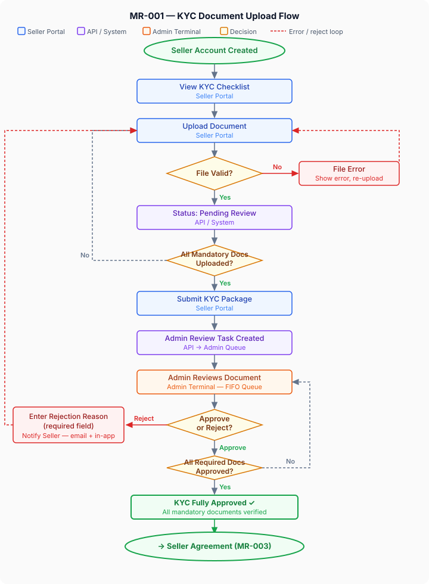

## 1. Overview

Before any seller can list products or transact on the MR platform, the platform must collect and verify a defined set of business and identity documents. This feature covers the end-to-end KYC (Know Your Customer) document upload flow: the seller submits required documents through the Seller Portal, those documents are queued for review in the Admin Terminal, and the admin team approves or rejects individual documents with reasons. The KYC status gates the seller's ability to proceed to the Seller Agreement and eventually go live.

The motivation is twofold: regulatory compliance (GST, PAN, BIS hallmarking obligations under Indian law) and platform trust — only verified businesses should be able to sell on a jewellery marketplace where high-value transactions are involved.

---

## 2. Roles & Personas

| Role | Type | Participation |
|------|------|---------------|
| Seller / Vendor | External User | Uploads required KYC documents through the Seller Portal |
| Platform Admin (KYC Reviewer) | Internal | Reviews submitted documents, approves or rejects with reasons via Admin Terminal |
| System | Automated | Validates file format/size at upload, triggers status notifications, updates KYC state machine |

---

## 3. User Stories

- As a **Seller**, I want to upload my KYC documents in one place so that I can complete my onboarding without emailing files back and forth.
- As a **Seller**, I want to see clearly which documents are required, optional, and already submitted so that I never miss a mandatory document.
- As a **Seller**, I want to be notified when my documents are approved or rejected, with a reason for rejection, so that I can resubmit without contacting support.
- As a **KYC Reviewer (Admin)**, I want to see all pending KYC submissions in a queue so that I can process them in order without missing any.
- As a **KYC Reviewer (Admin)**, I want to approve or reject individual documents — not the entire application — so that a seller doesn't have to resubmit everything if only one document fails.
- As a **Platform Admin**, I want to see a seller's full KYC history (submissions, rejections, approvals) so that I have a complete audit trail.

---

## 4. Feature Flow

End-to-end journey from seller account creation to KYC approval gate. Dashed lines indicate back-loops (re-upload / resubmit paths).

**Key loops:**
- File validation failure → re-upload (Seller Portal, API)
- Incomplete mandatory docs → upload more (Seller Portal)
- Admin rejection → seller notified → resubmit rejected doc only (does not reset approved docs)
- Partial approval → admin reviews remaining docs (Admin Terminal)

---

## 5. Functional Requirements

1. The system shall present a **KYC Document Checklist** to the seller on first login to the Seller Portal, listing all required and optional documents.
2. The system shall enforce upload of the following **mandatory documents** before KYC submission is allowed:
   - GST Registration Certificate
   - PAN Card (business or individual, as applicable)
   - Bank Account Details (cancelled cheque or bank statement)
   - Business Address Proof (utility bill, rental agreement, or equivalent)
3. The system shall treat the following as **conditional mandatory** documents (required only under defined conditions):
   - BIS Hallmarking Licence — required if seller lists gold or silver jewellery
   - Gemstone Certification Authority registration — required if seller lists certified gemstone jewellery
4. The following documents shall be **optional** at onboarding but may be requested later by admin:
   - Trademark registration certificate
   - Product liability insurance
5. For each document, the system shall accept uploads in **PDF, JPG, or PNG** format only, with a maximum file size of **10 MB per file**.
6. The system shall display a real-time **upload status indicator** per document (Not Uploaded / Uploaded – Pending Review / Approved / Rejected – Action Required).
7. On submission of the complete KYC package, the system shall create a **KYC Review Task** in the Admin Terminal queue, timestamped and attributed to the seller.
8. The Admin Terminal shall present KYC tasks in a **FIFO queue** (first-submitted, first-reviewed), with the ability to filter by status (Pending / Approved / Rejected / Incomplete).
9. A KYC Reviewer shall be able to **approve or reject individual documents**, not only the full submission. Each rejection must include a mandatory reason field (dropdown with free-text option).
10. On any document rejection, the system shall notify the seller via **email and in-app notification** with the document name and rejection reason, and prompt resubmission.
11. A seller shall be able to **resubmit a rejected document** without affecting the status of already-approved documents.
12. KYC shall be considered **fully approved** only when all mandatory documents (and applicable conditional mandatory documents) are individually approved.
13. The system shall **block progression** to the Seller Agreement step (MR-003) until KYC is fully approved.
14. All document uploads, reviews, approvals, and rejections shall be recorded in the **platform audit log** with actor, timestamp, and action.
15. Uploaded documents shall be stored in **encrypted cloud storage** and shall not be accessible via direct URL without a time-limited signed link.

---

## 6. Business Rules

- **GST is mandatory for all sellers** — no exceptions. A seller without GST registration cannot be onboarded. (Rationale: the platform has TCS obligations under GST law and cannot remit to unregistered sellers.)
- **BIS Licence conditionality:** If a seller's declared product categories include gold, silver, or platinum jewellery, the BIS Hallmarking Licence becomes mandatory. If the seller later adds such a category, the BIS Licence is requested before the new category goes live.
- **Rejection reason is mandatory:** An admin cannot submit a rejection without selecting or typing a reason. This is enforced at the API level, not just UI.
- **Document expiry:** GST certificates and licences have validity dates. The system shall capture the expiry date at upload and flag documents expiring within 30 days to the admin. Expired documents must be renewed before a seller can continue transacting.
- **Re-review SLA:** Once a seller resubmits a rejected document, the admin team has a target SLA of 2 business days to review. This SLA is configurable in platform settings. Breached SLAs should surface in the Admin Terminal dashboard.
- **One active KYC application at a time:** A seller cannot have two simultaneous open KYC submissions. If a review is pending, the seller is blocked from withdrawing and resubmitting the entire package (but may resubmit individual rejected documents).
- **Data retention:** KYC documents must be retained for a minimum of 5 years from the seller's last transaction, in compliance with Indian AML and financial record-keeping obligations.

---

## 7. Component Interaction Map

- **Seller Portal:** Hosts the KYC document checklist and upload interface. Displays per-document status indicators. Sends submission trigger. Displays rejection reasons and enables resubmission. Blocks the Seller Agreement step if KYC is incomplete.

- **Admin Terminal:** Displays the KYC review queue. Allows per-document approve/reject with reason. Shows full submission history and audit trail per seller. Surfaces expiry alerts and SLA breach flags.

- **APIs / Service Layer:** Manages the KYC state machine (per-document status + overall KYC status). Validates file type and size. Handles encrypted storage of documents via signed URL generation. Triggers notifications on status changes. Enforces business rules (mandatory fields, progression blocking). Exposes endpoints consumed by both Seller Portal and Admin Terminal.

- **Mobile App:** Out of scope for this BRS (sellers do not onboard via the mobile app).

- **Client Web:** Out of scope for this BRS (the customer-facing storefront has no role in seller KYC).

---

## 8. Acceptance Criteria

- [ ] A new seller account sees the KYC checklist on first login, with all mandatory, conditional, and optional documents labelled correctly.
- [ ] Uploading a file outside the accepted formats (e.g., .docx) is rejected at upload with a clear error message.
- [ ] Uploading a file over 10 MB is rejected at upload with a clear error message.
- [ ] After uploading all mandatory documents, the seller can submit the KYC package. Submission without all mandatory documents is blocked with a specific message listing missing items.
- [ ] Submitted KYC appears in the Admin Terminal review queue within 30 seconds.
- [ ] An admin can approve a single document without affecting others.
- [ ] An admin cannot reject a document without providing a rejection reason — the submit button is disabled until a reason is given.
- [ ] On rejection, the seller receives an email and in-app notification within 5 minutes, containing the document name and rejection reason.
- [ ] A seller can resubmit only the rejected document without disturbing approved documents.
- [ ] The Seller Agreement step (MR-003) is inaccessible until all required documents are approved — the CTA is disabled and displays a tooltip explaining why.
- [ ] Every approval and rejection event is visible in the audit log with actor identity and timestamp.
- [ ] A document nearing expiry (within 30 days) is flagged visually in the Admin Terminal.
- [ ] Documents are not accessible via a plain URL — only via time-limited signed links.

---

## 9. Out of Scope

- **Seller Registration / Account Creation** — covered in MR-002. This BRS begins after the seller account exists.
- **Seller Agreement acceptance** — covered in MR-003. KYC approval is a prerequisite, but the agreement flow itself is a separate BRS.
- **Admin verification of seller information against government databases** (e.g., GSTIN validation via GST API, PAN verification via NSDL) — these are technical enhancements. Phase 1 assumes human review. Automated verification may be a scope addition in a later milestone.
- **Seller payout bank account verification** (penny drop / IMPS test) — covered in Group 09 (Payout & Reconciliation).
- **Customer-facing trust badges or certification display** — covered in Group 10 (Trust & Authenticity).
- **Notification infrastructure** — this BRS defines what notifications must fire and their content. The technical notification service configuration is covered in Group 22.
- **Document storage infrastructure architecture** — this BRS specifies the functional requirement (encrypted, signed URLs). Infrastructure decisions (S3, GCS, etc.) are an architectural decision documented in the Tech Footprint.

---

## 10. Open Items / Decisions Pending

| # | Question | Owner | Due |
|---|----------|-------|-----|
| 1 | Should GSTIN be validated programmatically against the GST API at upload (real-time check), or manually reviewed by admin only? Automated validation adds trust but requires a third-party API integration. | Product Owner | — |
| 2 | What is the maximum number of rejection-resubmission cycles allowed before a KYC application is escalated or permanently rejected? Is there a cap? | Product Owner | — |
| 3 | Should the platform allow a grace period for document expiry (e.g., seller can continue trading for 30 days after expiry while renewal is in progress)? | Legal / Product Owner | — |
| 4 | Who is the CODEOWNERS reviewer for this group — which BA and which business stakeholder should be assigned as PR reviewers? | BA Lead | — |
| 5 | Confirm exact list of accepted document types for "Business Address Proof" — utility bill, rental agreement, what else? | Legal / Operations | — |

---

## 11. Testing Observations (Post-Implementation)

> To be filled by QA after implementation is complete. This section gates wiki promotion.

| # | Observation | Severity | Resolution | Status |
|---|-------------|----------|------------|--------|

---

## 12. Change Log

| Version | Date | Author | Summary |
|---------|------|--------|---------|
| 0.1 | 2026-04-25 | Claude (draft for BA review) | Initial draft — authored as mock BRS for BA team handoff |
